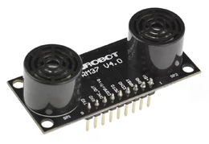

# urm37
[](https://crates.io/crates/urm37) [](https://docs.rs/urm37) [](LICENSE-MIT)


`no_std` embedded driver for the **DFRobot URM37 V4.0** ultrasonic distance sensor.

<div align="center">
  
</div>

An industrial-grade ultrasonic sensor offering advanced capabilities with improved accuracy, temperature correction, and versatile output modes. Supports all interface modes: synchronous/asynchronous UART, PWM trigger, and analog (DAC).

---

## Key Features (V4.0)

- **Serial Level Selection** — Onboard button to switch between RS232 and TTL modes (takes effect after reboot)
- **Improved Algorithm** — Reduced dead zone and enhanced accuracy
- **Analog Voltage Output** — DAC output directly proportional to measured distance (6.8 mV/cm)
- **Wide Voltage Support** — Operating range 3.3 V to 5.0 V
- **Hardware Safety** — Integrated power reverse protection
- **Configurable Timing** — Automatic measurement interval customizable via EEPROM
- **Servo Control** — 0–180° angle mapping (compatible with standard servos)
- `no_std` — works on any microcontroller
- Synchronous UART via [`embedded-io`](https://crates.io/crates/embedded-io)
- Asynchronous UART via [`embedded-io-async`](https://crates.io/crates/embedded-io-async) (Embassy, RTIC…)
- PWM conversion: ECHO pulse → distance in cm
- Analog conversion: raw DAC voltage → distance in cm
- Temperature reading with 0.1 °C resolution (UART mode)
- Internal EEPROM configuration (thresholds, mode, timing interval)
- Optional `defmt` support for embedded logging
- Zero dynamic allocation (heapless-free)

---

## Specifications

| Parameter                  | Value                        |
|----------------------------|------------------------------|
| **Power Supply**           | 3.3 V – 5.0 V               |
| **Operating Current**      | < 20 mA                     |
| **Operating Temperature**  | −10 °C to +70 °C            |
| **Detecting Range**        | 5 cm – 500 cm               |
| **Resolution**             | 1 cm                        |
| **Communication**          | RS232 / TTL (selectable), PWM, DAC |
| **Dimensions**             | 22 mm × 51 mm              |
| **Weight**                 | 25 g                        |

### Accuracy & Timing
- **PWM Mode (ECHO):** 50 µs per 1 cm (0–25000 µs pulse width)
- **Analog Mode (DAC):** 6.8 mV per 1 cm
- **Default Auto Interval:** 25 ms
- **Temperature Coefficient:** Automatic correction via on-chip sensor

---

## Integration with STM32 & Embassy

See **[EXAMPLES.md](EXAMPLES.md)** for:

- 5 real-world integration patterns (UART, PWM, ADC, configuration)
- Hardware wiring diagrams for each mode
- Build and flash instructions
- Troubleshooting guide
- Performance characteristics
- Board-specific setup examples

The documentation includes patterns for:
- **Async UART** - Simple distance & temperature reading
- **PWM mode** - High-precision input capture measurements
- **Analog/ADC** - Voltage-to-distance conversion
- **EEPROM config** - Sensor threshold and mode setup
- **Production code** - Error handling, retries, statistics

---

## Pin Configuration

| Pin | Label   | Description                                                              |
|-----|---------|--------------------------------------------------------------------------|
| 1   | VCC     | Power input (reference +5 V, accepts 3.3 V – 5.0 V)                    |
| 2   | GND     | Ground                                                                   |
| 3   | NRST    | Reset (active low)                                                       |
| 4   | ECHO    | PWM output: pulse width ∝ distance (50 µs = 1 cm, range 0–25000 µs)    |
| 5   | MOTO    | Servo motor control output (0–180° angle mapping)                       |
| 6   | COMP/TRIG | **COMP:** Pulls low when distance < threshold (comparator mode)         |
|     |         | **TRIG:** PWM trigger input for single measurements                     |
| 7   | DAC     | Analog voltage output (6.8 mV per 1 cm)                               |
| 8   | RXD     | Serial data receive (RS232 / TTL level, configurable)                  |
| 9   | TXD     | Serial data transmit (RS232 / TTL level, configurable)                 |

> **WARNING:** Select RS232 or TTL mode via the on-board button before wiring.  
> **Never** connect a TTL MCU while the sensor is in RS232 mode — permanent damage will result.  
> Default: **TTL level** (LED flashes: 1 long + 1 short). Press button 1 second (until LED off), then cycle power.

---

## Communication Protocol

### Serial Settings
- **Baud Rate:** 9600 bps
- **Parity:** None
- **Stop Bits:** 1
- **Data Bits:** 8

### Frame Format
All commands consist of **4 bytes:** `[Command] [Data0] [Data1] [SUM]`

`SUM` = low 8 bits of the sum of the first 3 bytes (checksum).

### Command Reference

#### Live Measurement Commands

| Operation | Frame | Response | Notes |
|-----------|-------|----------|-------|
| **Read Distance** | `0x22 Deg 0x00 SUM` | `0x22 High Low SUM` | Distance (cm) = `(High × 256) + Low`. Returns `0xFF 0xFF` if invalid. `Deg` drives servo (0x00 if unused). |
| **Read Temperature** | `0x11 0x00 0x00 0x11` | `0x11 High Low SUM` | 0.1 °C resolution. High byte bits [7:4]: if 0 → positive, if 1 (0xF0) → negative. Returns `0xFF 0xFF` if invalid. |

#### EEPROM Access Commands

| Operation | Frame | Response | Notes |
|-----------|-------|----------|-------|
| **Read EEPROM** | `0x33 Add 0x00 SUM` | `0x33 Add Data SUM` | Reads configuration value at address `Add`. |
| **Write EEPROM** | `0x44 Add Data SUM` | `0x44 Add Data SUM` | Sensor echoes the frame to confirm successful write. |

### EEPROM Memory Map (Configuration Registers)

| Address | Name | Values | Purpose |
|---------|------|--------|---------|
| `0x00` | **Low Threshold** | 0x00–0xFF (cm) | COMP pin triggers low if distance **≥** this value |
| `0x01` | **High Threshold** | 0x00–0xFF (cm) | COMP pin triggers low if distance **≤** this value |
| `0x02` | **Operating Mode** | `0xAA` = Autonomous, other = Passive PWM | Controls measurement behavior |
| `0x03` | **Serial Level** | `0x00` = TTL, `0x01` = RS232 | Selects UART signal voltage |
| `0x04` | **Time Interval** | 25–255 ms (hex value) | Polling delay in Autonomous mode; `0x64` = 100 ms |

**Default factory values:** All registers initialized to `0x00`.

### Measurement Modes

1. **PWM Triggered Mode**  
   Host sends a low pulse (> 1 µs) on COMP/TRIG pin. Sensor responds with ECHO pulse width encoding distance.

2. **Autonomous (Automatic) Mode**  
   Sensor automatically measures at user-defined intervals (register `0x04`). If measured distance ≤ High Threshold **or** ≥ Low Threshold, COMP pin pulls low (ultrasonic switch behavior).

3. **Serial Passive Mode**  
   Host MCU queries sensor via UART commands (0x22 for distance, 0x11 for temperature).

### Servo Rotation Mapping

The MOTO pin accepts angle codes (0x00–0x1E) that map to 0–176°:

| Hex | Deg | Hex | Deg | Hex | Deg | Hex | Deg |
|-----|-----|-----|-----|-----|-----|-----|-----|
| 0x00 | 0° | 0x01 | 6° | 0x02 | 12° | 0x03 | 18° |
| 0x04 | 24° | 0x05 | 29° | 0x06 | 35° | 0x07 | 41° |
| 0x08 | 47° | 0x09 | 53° | 0x0A | 59° | 0x0B | 65° |
| 0x0C | 70° | 0x0D | 76° | 0x0E | 82° | 0x10 | 94° |
| 0x11 | 100° | 0x12 | 106° | 0x13 | 112° | 0x14 | 117° |
| 0x15 | 123° | 0x16 | 129° | 0x17 | 135° | 0x18 | 141° |
| 0x19 | 147° | 0x1A | 153° | 0x1B | 159° | 0x1C | 164° |
| 0x1D | 170° | 0x1E | 176° | — | — | — | — |

---

## Examples

This crate includes three ready-to-run examples for **STM32F767ZI with Embassy**:

### 1. Async UART Mode (`examples/uart_async_stm32.rs`)

Demonstrates synchronous distance and temperature reading via UART, plus EEPROM configuration.

**Hardware:**
- STM32F767ZI (Nucleo F767ZI)
- UART5: RX=PD2, TX=PC12

**Run:**
```bash
cargo run --example uart_async_stm32 --features uart-async --release
```

**Features:**
- Read distance in cm
- Read temperature (0.1 °C resolution)
- Configure COMP thresholds via EEPROM
- Passive mode (MCU queries sensor on demand)

---

### 2. PWM Passive Mode (`examples/pwm_stm32.rs`)

Demonstrates high-precision distance measurement using GPIO trigger + InputCapture ECHO pin.

**Hardware:**
- STM32F767ZI (Nucleo F767ZI)
- GPIO PA0: TRIG output (active LOW)
- TIM2 CH1 PA5: ECHO input (InputCapture)
- Timer: 1 MHz (1 tick = 1 µs)

**Run:**
```bash
cargo run --example pwm_stm32 --features pwm --release
```

**Features:**
- Trigger pulse generation (10 ms default)
- Echo pulse measurement with microsecond precision
- Direct distance calculation from pulse width

---

### 3. Analog/ADC Mode (`examples/analog_stm32.rs`)

Demonstrates simple voltage-to-distance conversion using ADC.

**Hardware:**
- STM32F767ZI (Nucleo F767ZI)
- ADC1 PA4: Analog voltage from URM37 (6.8 mV/cm)

**Run:**
```bash
cargo run --example analog_stm32 --features analog --release
```

**Features:**
- 12-bit ADC reading
- Direct ADC-to-distance conversion
- No UART or timing logic required (simplest option)

---

## Installation

```toml
[dependencies]
# Choose the features you need:
urm37 = { version = "0.6", features = ["uart-async"] }
# or
urm37 = { version = "0.6", features = ["uart", "pwm", "analog"] }
```

---

## Usage

### Asynchronous UART (Embassy)

```rust
use urm37::uart_async::Urm37UartAsync;

let mut sensor = Urm37UartAsync::new(uart);

// Distance in centimetres
let dist_cm = sensor.read_distance().await?;

// Temperature in tenths of °C (235 = 23.5 °C)
let temp = sensor.read_temperature().await?;
let temp_c = temp as f32 / 10.0;
```

### Synchronous UART

```rust
use urm37::uart::Urm37Uart;

let mut sensor = Urm37Uart::new(uart);
let dist_cm = sensor.read_distance()?;
```

### PWM mode

```rust
use urm37::pwm::pulse_to_distance_cm;

// Trigger the measurement:
// 1. Pull COMP/TRIG low (> 1 µs)
// 2. Release high
// 3. Measure the ECHO pulse width with a timer

let pulse_us: u32 = measure_echo_us(); // your implementation
match pulse_to_distance_cm(pulse_us) {
    Some(cm) => println!("Distance: {} cm", cm),
    None     => println!("Out of range"),
}
```

### Analog mode

```rust
use urm37::analog::adc_to_distance_cm;

// 12-bit ADC (STM32, RP2040…)
let raw: u16 = adc.read(&mut dac_pin)?;
let cm = adc_to_distance_cm(raw, 4095);
```

### EEPROM configuration

```rust
use urm37::{uart_async::Urm37UartAsync, EepromRegister};

let mut sensor = Urm37UartAsync::new(uart);

// Set COMP/Switch threshold to 50 cm
sensor.set_comp_threshold(50).await?;

// Auto-measure every second (40 × 25 ms)
sensor.set_auto_mode(40).await?;

// Return to passive mode
sensor.set_passive_mode().await?;
```

---

## Choosing the Right Mode

| Mode | Pros | Cons | Best For |
|------|------|------|----------|
| **UART** | Full sensor control, temperature, EEPROM config | Requires serial setup, 9600 bps | Configurable systems, monitoring |
| **PWM/ECHO** | High precision (1 cm), no additional pins | Manual triggering, timer required | Applications needing accuracy |
| **Analog/ADC** | Simplest, no UART or special timing | Fixed 6.8 mV/cm mapping, lower precision | Cost-sensitive, simple trigger systems |

---

## Cargo features

| Feature       | Default | Description                              |
|---------------|---------|------------------------------------------|
| `uart`        | no      | Synchronous UART driver (`embedded-io`)  |
| `uart-async`  | no      | Async UART driver (`embedded-io-async`)  |
| `pwm`         | no      | PWM mode utilities (`embedded-hal`)      |
| `analog`      | no      | Analog/ADC mode utilities (`embedded-hal`) |
| `defmt`       | no      | `defmt` logging on error types           |

---

## `embedded-hal` compatibility

| Crate               | Version |
|---------------------|---------|
| `embedded-hal`      | 1.0     |
| `embedded-io`       | 0.6     |
| `embedded-io-async` | 0.6     |

---

## Troubleshooting

### Communication Failures
- **Check serial level mode:** Verify the sensor's physical serial level mode (TTL vs. RS232) matches your microcontroller interface.
- **Button configuration:** Press the on-board button for 1 second (LED turns off), then cycle power to activate mode changes.
- **Baud rate:** Ensure communication at 9600 bps, 8 data bits, no parity, 1 stop bit.

### Measurement Issues

**Unstable or invalid readings (0xFFFF returned)**
- Ultrasonic signals attenuate as `1/d²` in open environments.
- Ensure good surface alignment and target orientation.
- Soft surfaces or narrow objects (e.g., pens) may not reflect ultrasound effectively.

**ECHO pulse out of range**
- Check power supply voltage (3.3 V – 5.0 V).
- Verify ECHO pin is not floating or damaged.
- Ensure pull-up resistor on ECHO if needed by your MCU.

**COMP threshold not triggering**
- Read EEPROM registers `0x00` (low) and `0x01` (high) to confirm threshold values.
- Verify the sensor is in Autonomous mode (`0x02` = `0xAA`).
- Check the logic: COMP pulls low when distance **≤ high threshold OR ≥ low threshold**.

### Servo Control
- Angle mapping uses hex codes `0x00` (0°) to `0x1E` (176°).
- MOTO output is 5 V logic; ensure servo is compatible.
- Non-standard servo models may require PWM conditioning.

---

## License

Dual-licensed under MIT and Apache 2.0 — your choice.
